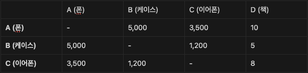

모델 1: Co-visitation

“사용자들이 한 세션에서 함께 본 아이템들은 서로 관련이 깊다”는 가정에 기반한 방법.

작동 방식
1.	오프라인 계산
    - 모든 세션 로그로부터 아이템-아이템 동시 등장 행렬을 계산.
        
2.	온라인 추천
    - 사용자가 A(스마트폰)를 클릭 → A 행을 조회 → 동시 등장 횟수가 높은 B(케이스), C(이어폰) 추천.
    - 계산은 단순 조회(lookup)에 불과해 매우 빠름.
3. 역할 및 특성
    - 역할: 최종 랭킹 이전의 후보 생성 단계에서 자주 사용.
    - 장점: 단순·빠름·구현 용이, 최신 행동 반영 효과적.
	- 단점: Cold Start(신규/저빈도 아이템)에 취약, 장기 선호보다는 인기 조합에 의존.

⸻

모델 2: Matrix Factorization (MF)

사용자–아이템 상호작용 행렬을 두 개의 잠재 요인 행렬로 분해하는 방법.

작동 방식
1. 사용자 = k차원 임베딩 벡터
2.	아이템 = k차원 임베딩 벡터
3.	두 벡터의 내적(dot product)으로 선호도 예측

\hat{y}_{ui} = \langle p_u, q_i \rangle

역할 및 특성
- 역할: FM, 딥러닝 추천 모델의 기초 아이디어.
- 장점: 희소 행렬을 압축, 잠재 요인을 통한 일반화.
- 단점: 비선형 상호작용 포착은 제한적.

⸻

모델 3: Two-Tower 모델

MF를 딥러닝으로 확장한 산업계 표준 후보 생성 구조.

구조
- User Tower: 사용자 피처(user_id, 나이, 과거 행동 등) → 사용자 임베딩
- Item Tower: 광고 피처(ad_id, 카테고리 등) → 아이템 임베딩

학습
- Positive pair(클릭): 두 임베딩을 가깝게
- Negative pair(비클릭): 두 임베딩을 멀게

추론
1.	오프라인: Item Tower로 모든 광고 임베딩을 사전 계산해 DB에 저장
2.	온라인: User Tower로 사용자 임베딩만 계산
3.	ANN 검색으로 가장 가까운 광고 벡터 수백 개를 후보로 반환

역할 및 특성
- 역할: 대규모 시스템에서 가장 많이 쓰이는 후보 생성 표준 아키텍처.
- 장점: 사용자·아이템 피처를 풍부하게 반영 가능, 실시간 확장성.
- 단점: 학습/추론 리소스 요구 높음.

⸻

검색 1: Approximate Nearest Neighbor (ANN)

Two-Tower 구조를 실제 서비스에서 가능하게 만드는 검색 기술.

개념
- 수억 개 아이템 벡터 중에서 특정 사용자 벡터와 가까운 것들을 빠르게 찾음.
- 정확도 일부를 희생하고 검색 속도 수천 배 향상.

대표 라이브러리
- Faiss (Meta AI)
- ScaNN (Google)
- Annoy (Spotify)
- hnswlib

역할 및 특성
- 역할: 후보 검색 인프라.
- 장점: 실시간 추천 가능하게 함.
- 단점: 근사치 검색이라 100% 정확 보장은 안 됨.